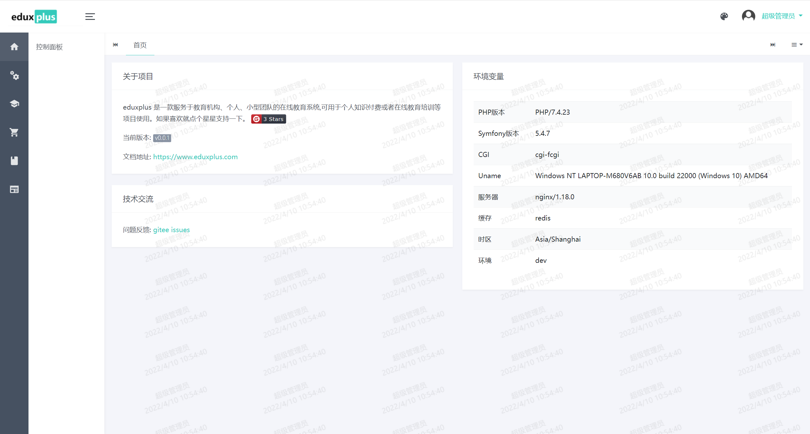
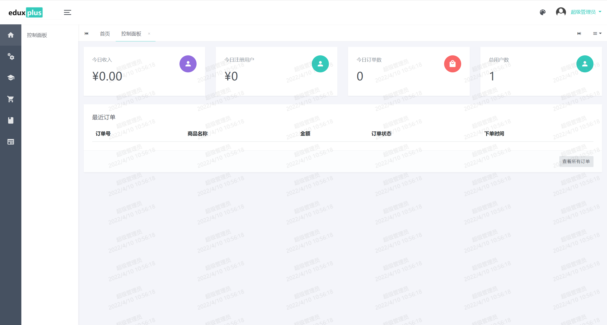
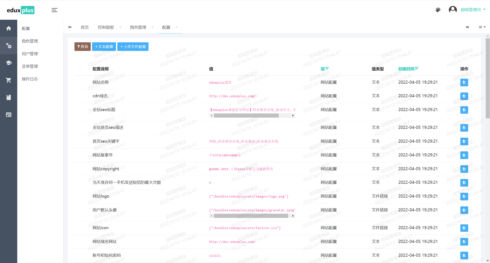
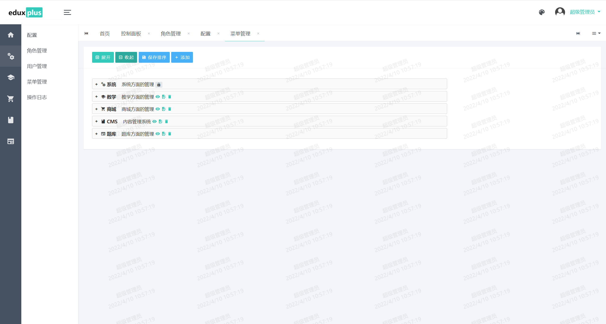
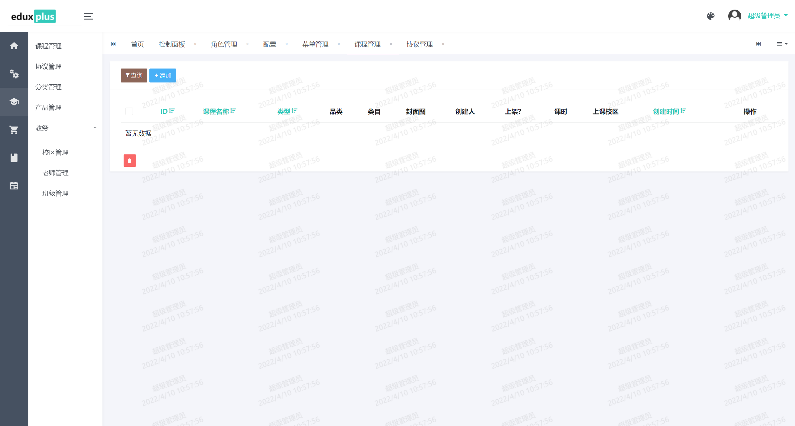
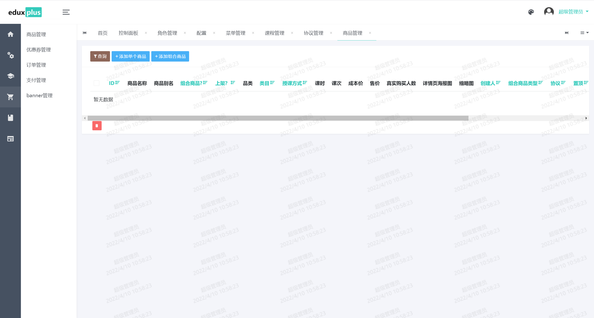

<div align="center"><h3 align="center">eduxplus 在线教育平台</h3></div>
<div align="center"><h3 align="center">eduxplus 是一款服务于教育机构、个人、小型团队的在线教育系统,可用于个人知识付费或者在线教育培训等项目使用</h3></div>
 
<p align="center">
    <a href='https://gitee.com/huagelong/eduxplus/stargazers'></img></a>
    <a href='https://gitee.com/huagelong/eduxplus/members'></img></a>
</p>

# 如果您觉得有帮助，请点右上角 "Star" 支持一下，谢谢！
> 注意本项目唯一反馈渠道: [https://gitee.com/huagelong/eduxplus/issues](https://gitee.com/huagelong/eduxplus/issues)

## 项目介绍
eduxplus 是一款服务于教育机构、个人、小型团队的在线教育系统,可用于个人知识付费或者在线教育培训等项目使用,基于symfony.

## demo地址
- 前台地址: https://demo.eduxplus.com  账号:10000000000 密码:123456
- 后台地址: https://demo.eduxplus.com/admin  账号:10000000000 密码:123456


## 功能一览
- 教务
  - 校区管理
  - 老师管理
  - 班级管理
- 教研
  - 协议管理
  - 课程管理
  - 产品管理
  - 课程分类
- 商城
  - 商品管理
  - 优惠券
  - 订单管理
  - 支付管理
  - 帮助系统
  - 资讯管理
  - banner管理
- 试题
  - 试题管理
    - 知识点
      - 题目
  - 试卷管理
  - 试卷商品管理


## 相关截图






## 特色
> 整个系统主线从课程->产品->开课计划->商品，流程清晰，支持滚动开课，开班
## 安装

#### 必要条件

- PHP >= 7.4;
- PDO PHP Extension;
- GD PHP extension;
- ZIP PHP extension;
- putenv(),readlink(),symlink() 函数不能禁用 
- MySQL >= 5.7;
- Redis >= 5.0.0;
- And the [https://symfony.com/doc/current/reference/requirements.html](https://symfony.com/doc/current/reference/requirements.html).

#### 安装步骤
> 以下步骤在linux系统操作,windows类似

1.安装 Composer (详见 http://getcomposer.org/download)

2.安装 symfony_cli (详见 https://symfony.com/download)

3.安装 git (详见 https://git-scm.com/downloads)

4.下载代码
```$shell
git clone https://gitee.com/huagelong/eduxplus.git
```

5.进入代码根目录，修改配置

```$shell
cp .env .env.local
// 打开.env.local 添加数据库DATABASE_URL，redis配置REDIS_HOST

```

4.执行

```$php
composer install
//初始化数据
composer gen
```

5.配置 计划任务 (多台服务器做负载时建议只开启一台服务器执行计划任务)

```$shell
crontab -e
* * * * * cd /path-to-your-project && php ./bin/console schedule:run >> /dev/null 2>&1
```
6.nginx配置
> ./docs/nginx.conf 是配置例子，可以参考

7.or 直接运行下面命令
```$shell
symfony serve
//打开 http://127.0.0.1:8000 进行预览
```

## docker 安装

```$shell
//系统安装好docker,docker-compose进入根目录执行下面命令
docker-compose up -d
docker-compose run php composer install -v
docker-compose run php composer gen
//添加host为: 服务器ip local.eduxplus.com， 例如 192.168.159.128 local.eduxplus.com
//浏览器打开 http://local.eduxplus.com:81 进行预览
```

## 相关文档

 - [https://symfony.com/](https://symfony.com/)
 - [https://symfony.com/doc/current/reference/requirements.html](https://symfony.com/doc/current/reference/requirements.html)
 - [https://getcomposer.org/doc/03-cli.md#create-project](https://getcomposer.org/doc/03-cli.md#create-project)

## 鸣谢
 - [https://gitee.com/yinqi/Light-Year-Admin-Using-Iframe-v4](https://gitee.com/yinqi/Light-Year-Admin-Using-Iframe-v4)
 - [https://gitee.com/sentsin/layui/](https://gitee.com/sentsin/layui/)
 
